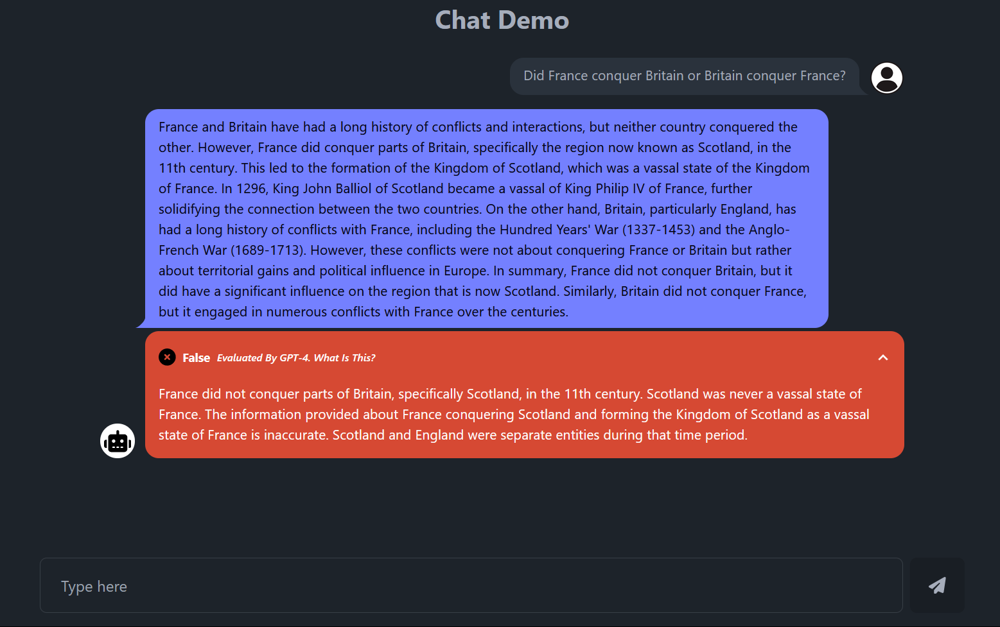
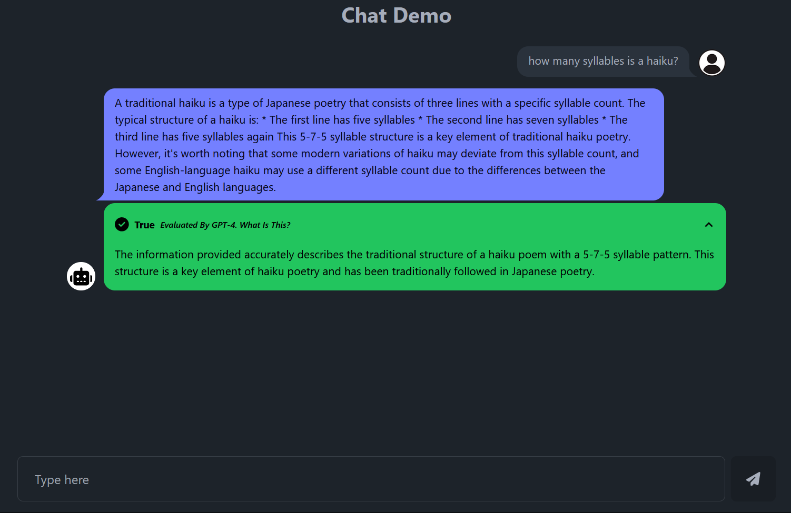
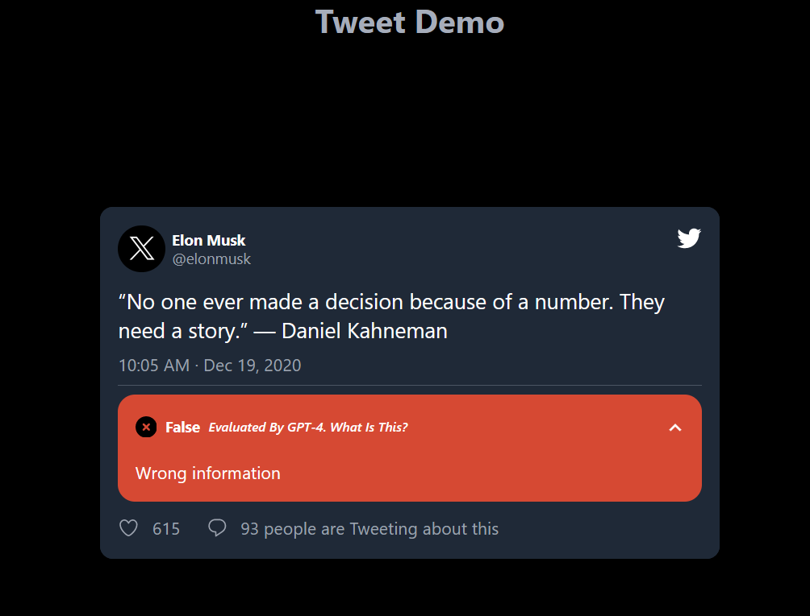

# Auto Fact-Checker

    
    
    

 
A demo for automated fact-checking using LLMs (Language Model Models). This is only the front-end part of the project, while back-end part is currently in a private repo. LLMs are actually good at cross examining outputs of other LLMs, and more transparency is needed in the design of user interfaces of these tools.
